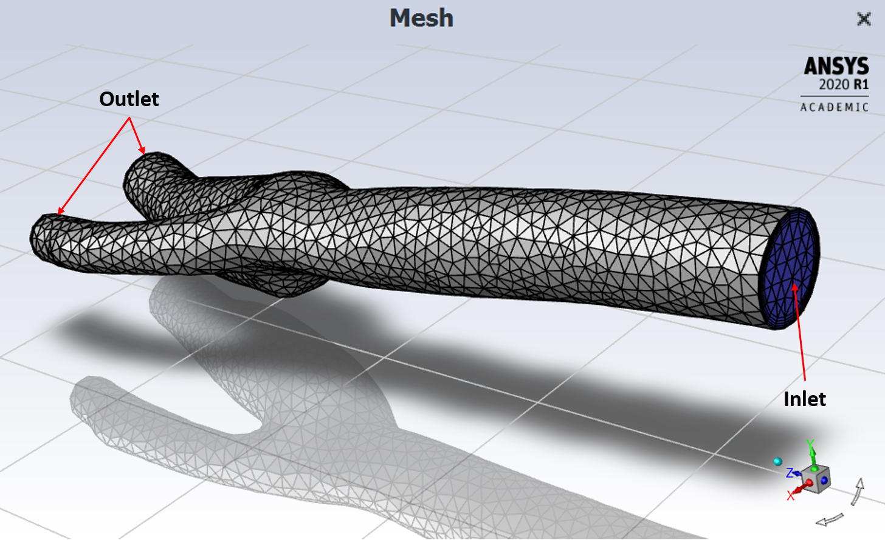
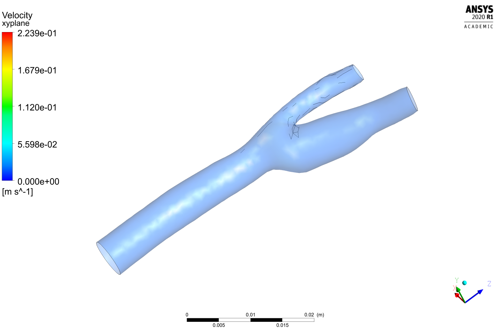
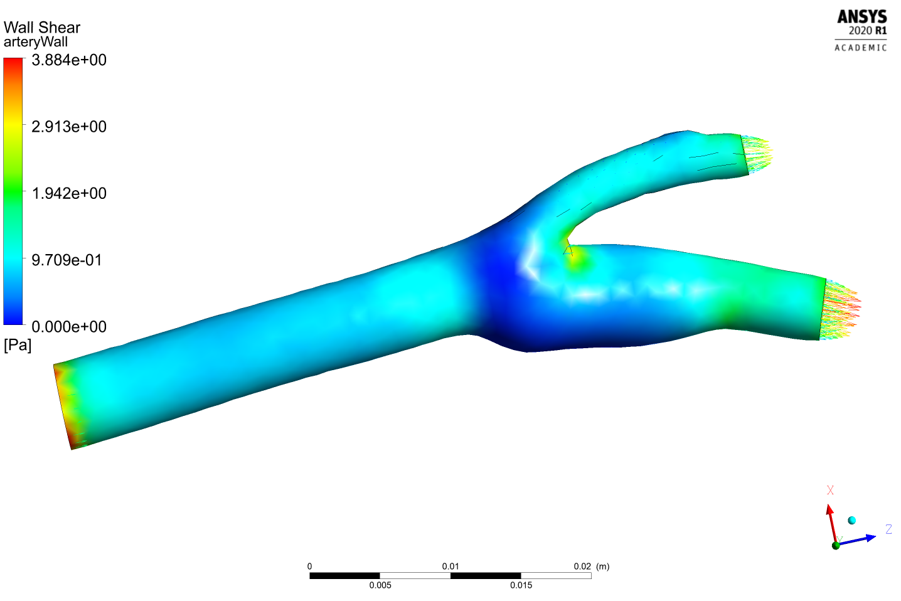
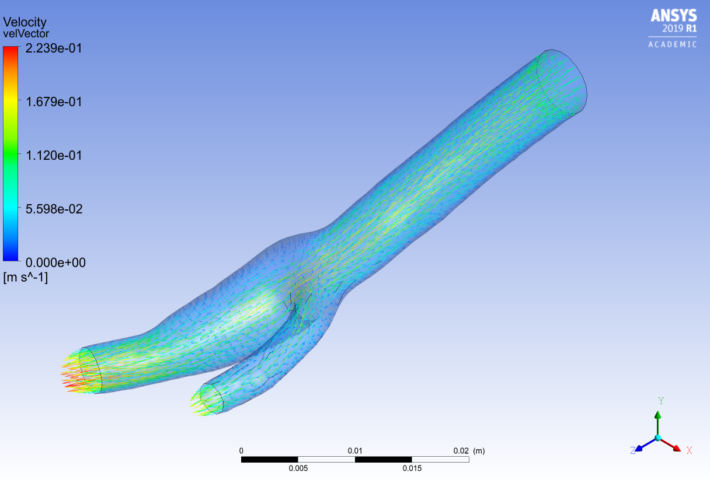

# bifurcatedArtery
The following represents a fluid flow simulation of two particles in a bifurcating artery where the fluid flows from one free end and diverges.
The fluid was blood and the two solid particles were two specs of aluminum. Laminar flow is employed throughout with a time dependent velocity typically greater than 0.1 m/s.
The two outlet diverging arteries are set to identical pressures, but one artery is wider in diameter and naturally welcomes more fluid flow.

### Wall Shear

### Velocity Vectors

The remaining video results are found in the user_files directory

## Built With

* [WorkBench 2020 R1](https://www.ansys.com/products/platform) - CAE simulation framework used
* [Ansys Fluent](https://www.ansys.com/products/fluids/ansys-fluent) - Fluid Flow CFD software
* [CFD-Post](https://www.ozeninc.com/products/fluid-dynamics/ansys-cfd-post/) - Results post processor

## License

This project is licensed under the MIT License - see the [LICENSE.md](LICENSE.md) file for details
